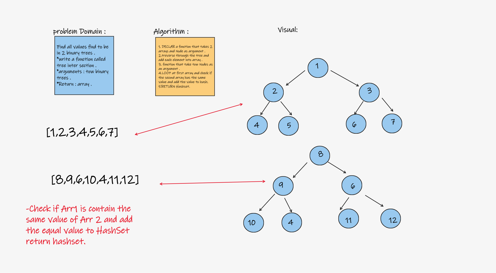
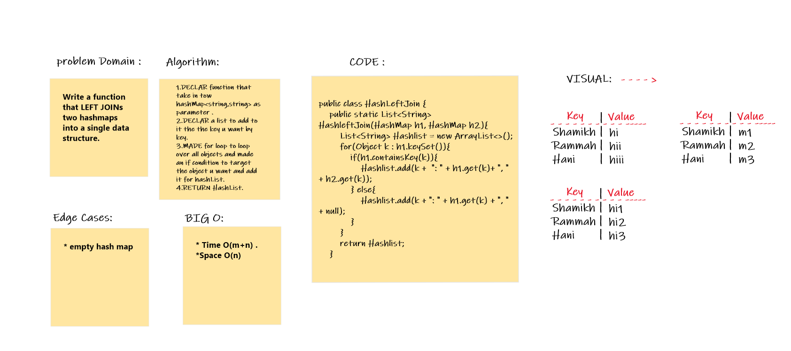

## Hash Table :
- Data structure to handle/store key-value pairs.

## Challenge:
- Implement a Hashtable with the following methods:

* **add:** takes in both the key and value. This method should hash the key, and add the key and value pair to the table, handling collisions as needed.
* **get:** takes in the key and returns the value from the table.

## Approach & Efficiency (BigO)
* **add:** My approach was to check first if there will be a collision (same key) and handle appropriately the addition of the new key-value pair. Time complexity is O(1).

* **get:** My approach was to return the value of the given key after using the hash function to check the map. Time compexity is O(1).

* **hash:** Time complexity is O(1).

* **contains:** My approach is to first use the hash function to hash the given key and use it to check the map if it returns not null. Time complexity is O(1).

## API
- public void add(K key, V value)
- public String get(K key)
- publice remove(K key )

## Repeated word
### Challenge:
- Write a function called repeated word that finds the first word to occur more than once in a string Arguments: string Return: string.

Solution:

## Code
 public String checkRepeated(String string) throws Exception {

        String arrString[]=string.split(" ");
        HashTable<String,Integer> hashTable= new HashTable<>();
        for (String s: arrString){
            String lowerString= s.toLowerCase();
            if (hashTable.contains(lowerString))return lowerString;
            hashTable.add(lowerString,1);
        }
        return null;
    }
## Big(O)
- time complixty O(n) ,where n is the number of table buckets in worst case.

## Egde cases
if the word has a coma , Exclamation mark ,..
there is no word repeated. the string is only one word.

## Tests
  @Test void checkRepeatedTest() throws Exception {

                HashTable<String,Integer> hashTable= new HashTable<>();

                assertEquals("it", hashTable.checkRepeated("It was the best of times, it was the worst of times, " +
                        "it was the age of wisdom, it was the age of foolishness, it was the epoch of belief, it was the epoch " +
                        "of incredulity, it was the season of Light, it was the season of Darkness, it was the spring of hope, " +
                        "it was the winter of despair, we had everything before us, we had nothing before us, we were all going " +
                        "direct to Heaven, we were all going direct the other way – in short, the period was so far like the present " +
                        "period, that some of its noisiest authorities insisted on its being received, for good or for evil, " +
                        "in the superlative degree of comparison only..."));
        } @Test void checkSecond() throws Exception {

                String string = "A strawberry is a strawberry";
                HashTable<String,Integer> hashTable= new HashTable<>();
                assertEquals("a" ,hashTable.checkRepeated(string));
        }

# Tree Intersection

## Challenge:
- Find all values found to be in 2 binary trees.
Write a function called tree intersection Arguments: two binary trees Return: array.

## Solution: 

## Code :

public class TreeIntersection {
    public static List treeIntersection(Tree tree1, Tree tree2) {
        List treeOne = tree1.inOrder(tree1.root);
        List treeTwo = tree1.inOrder(tree2.root);
        List results = new ArrayList<>();
        HashTable hashtable = new HashTable();
        for (int i = 0; i < treeOne.size(); i++) {
            hashtable.add(treeOne.get(i),i);
            if (hashtable.contain(treeTwo.get(i))){
                results.add(treeTwo.get(i));
            }
        }
        return  results;
    }
}

## Approach & Efficiency Big(O)

- My approach was to use a Result as the returning value after a depth first search on both Binary Trees. The time complexity is O(n + h).

## Egde cases
- two epmty trees
- one empty tree
- no intersection.

## Left Join
### Challenge:
- Write a function that LEFT JOINs two hashmaps into a single data structure.

- Write a function called left join Arguments: two hash maps The first parameter is a hashmap that has word strings as keys, and a synonym of the key as values. The second parameter is a hashmap that has word strings as keys, and antonyms of the key as values. Return: The returned data structure that holds the results is up to you. It doesn’t need to exactly match the output below, so long as it achieves the LEFT JOIN logic NOTES:

- Combine the key and corresponding values (if they exist) into a new data structure according to LEFT JOIN logic. LEFT JOIN means all the values in the first hashmap are returned, and if values exist in the “right” hashmap, they are appended to the result row. If no values exist in the right hashmap, then some flavor of NULL should be appended to the result row.

### Solution:

## Code :

public class HashLeftJoin {
    public static List<String> HashleftJoin(HashMap h1, HashMap h2){
        List<String> Hashlist = new ArrayList<>();
        for(Object k : h1.keySet()){
            if(h1.containsKey(k)){
                Hashlist.add(k +  ": " + h1.get(k)+ ", " + h2.get(k));
            } else{
                Hashlist.add(k + ": " + h1.get(k) + ", " + null);
            }
        }
        return Hashlist;
    }

## Test :

 public void test_leftWithSomeJoins(){
                HashMap h1 = new HashMap();
                h1.put("Shamikh", "rami"); //
                h1.put("im", "angery"); //
                HashMap h2 = new HashMap();
                h2.put("Shamikh", "quraan");
                h2.put("ana", "what");
                h2.put("He", "sham");
                List<String> list = new ArrayList<>();
                list.add("guide: usher, null");
                list.add("shamikh: rami, quraan");
                assertEquals( list ,  HashLeftJoin.HashleftJoin(h1, h2));
        }

## BIG O :

* Time O(m+n) .
* Space O(n) .
