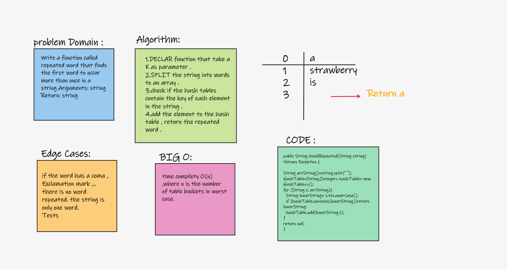

## Hash Table :
- Data structure to handle/store key-value pairs.

## Challenge:
- Implement a Hashtable with the following methods:

* **add:** takes in both the key and value. This method should hash the key, and add the key and value pair to the table, handling collisions as needed.
* **get:** takes in the key and returns the value from the table.

## Approach & Efficiency (BigO)
* **add:** My approach was to check first if there will be a collision (same key) and handle appropriately the addition of the new key-value pair. Time complexity is O(1).

* **get:** My approach was to return the value of the given key after using the hash function to check the map. Time compexity is O(1).

* **hash:** Time complexity is O(1).

* **contains:** My approach is to first use the hash function to hash the given key and use it to check the map if it returns not null. Time complexity is O(1).

## API
- public void add(K key, V value)
- public String get(K key)
- publice remove(K key )

## Repeated word
### Challenge:
- Write a function called repeated word that finds the first word to occur more than once in a string Arguments: string Return: string.

Solution:

## Code
 public String checkRepeated(String string) throws Exception {

        String arrString[]=string.split(" ");
        HashTable<String,Integer> hashTable= new HashTable<>();
        for (String s: arrString){
            String lowerString= s.toLowerCase();
            if (hashTable.contains(lowerString))return lowerString;
            hashTable.add(lowerString,1);
        }
        return null;
    }
## Big(O)
- time complixty O(n) ,where n is the number of table buckets in worst case.

## Egde cases
if the word has a coma , Exclamation mark ,..
there is no word repeated. the string is only one word.

## Tests
  @Test void checkRepeatedTest() throws Exception {

                HashTable<String,Integer> hashTable= new HashTable<>();

                assertEquals("it", hashTable.checkRepeated("It was the best of times, it was the worst of times, " +
                        "it was the age of wisdom, it was the age of foolishness, it was the epoch of belief, it was the epoch " +
                        "of incredulity, it was the season of Light, it was the season of Darkness, it was the spring of hope, " +
                        "it was the winter of despair, we had everything before us, we had nothing before us, we were all going " +
                        "direct to Heaven, we were all going direct the other way – in short, the period was so far like the present " +
                        "period, that some of its noisiest authorities insisted on its being received, for good or for evil, " +
                        "in the superlative degree of comparison only..."));
        } @Test void checkSecond() throws Exception {

                String string = "A strawberry is a strawberry";
                HashTable<String,Integer> hashTable= new HashTable<>();
                assertEquals("a" ,hashTable.checkRepeated(string));
        }