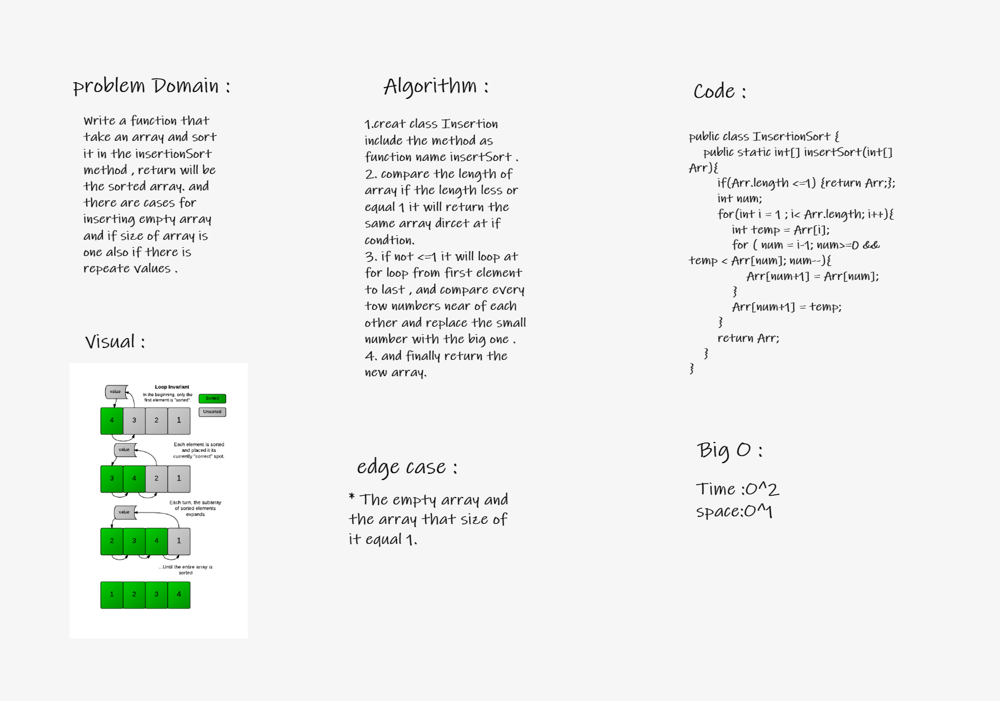

## Insertion Sort:
## Challenge Summary
Write a function that take an array and sort it in the insertionSort method , return will be the sorted array. and there are cases for inserting empty array and if size of array is one also if there is repeate values . 

## Whiteboard process:

## Efficency:

Time Complexity: O(n^2)
Space Complexity: O(1)

- Reverse-sorted takes maximum time to sort if elements are sorted in reverse order. And it takes minimum time (Order of n) when elements are already sorted.