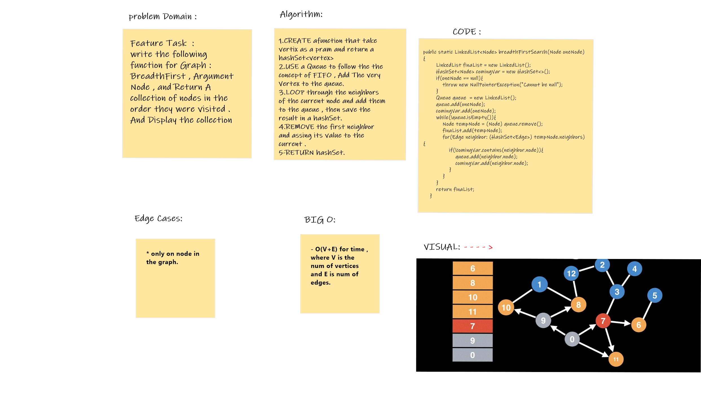

# Challenge:Graph

- **Implement your own Graph.** The graph should be represented as an adjacency list, and should include the following methods:

- **add node Argument: value Returns:** The added node Add a node to the graph.
- **add edge Arguments:** 2 nodes to be connected by the edge, weight (optional).
- **Returns:** nothing Adds a new edge between two nodes in the graph If specified, assign a weight to the edge Both nodes should already be in the Graph.
- **get nodes Arguments:** none Returns all of the nodes in the graph as a collection (set, list, or similar).
- **get neighbors Arguments:** node Returns a collection of edges connected to the given node Include the weight of the connection in the returned collection size Arguments: none.

## Code:

public class Graph<T> {
    public HashSet<Node<T>> vertices;
    public Graph(){
        this.vertices = new HashSet<>();
    }
    @SuppressWarnings("unchecked")
    public Node<T>addNode(T data){
        Node node = new Node(data);
        this.vertices.add(node);
        return node;
    }
    public boolean addEdge(Node<T> source, Node<T> destination){
        if(this.vertices.contains(source) && this.vertices.contains(destination)){
            this.vertices.add(source);
            this.vertices.add(destination);
            return true;
        }
        return false;
    }
    public void getEdges(String[] input){
    }

    public HashSet<Node<T>>getNodes(){
        return this.vertices;
    }

    public HashSet<Edge> getNeighbors(Node<T> node){
        return node.neighbors;
    }

    public int getSize(){
        return this.vertices.size();
    }
}

## Tests :

## All tests is run with out any wrong .

class AppTest {
    @Test
    public void addingNode() {
        Graph graph = new Graph();
        Node shamikh = graph.addNode("shamikh");
        Node ahmad = graph.addNode("ahmad");
        Node aya = graph.addNode("aya");
        Node walaa = graph.addNode("walaa");
        assertTrue( graph.getSize() == 4);
        assertTrue( graph.getNodes().contains(shamikh));
        assertTrue( graph.getNodes().contains(ahmad));
        assertTrue( graph.getNodes().contains(walaa));
        assertTrue( graph.getNodes().contains(aya));
    }

    @Test
    public void addEdge() {
        Graph edgeGraph = new Graph();
        Node one = edgeGraph.addNode("one");
        Node tow = edgeGraph.addNode("tow");
        Node three = edgeGraph.addNode("three");
        assertTrue( edgeGraph.addEdge(one, tow));
        assertTrue( edgeGraph.addEdge(one, three));
    }

    @Test
    public void zeroGraph(){
        Graph empty = new Graph();
        assertEquals( 0, empty.getSize());
    }
    @Test
    public void getNodes() {
        Graph graph = new Graph();
        Node shamikh = graph.addNode("shamikh");
        Node ahmad = graph.addNode("ahmad");
        Node aya = graph.addNode("aya");
        Node walaa = graph.addNode("walaa");
        HashSet<Node> otherNode = new HashSet<>();
        otherNode.add(shamikh);
        otherNode.add(ahmad);
        otherNode.add(aya);
        otherNode.add(walaa);
        assertTrue( graph.getNodes().equals(otherNode));
    }

    @Test
    public void noWeightAdding(){
        Graph newGraphV = new Graph();
        Node shamikh = newGraphV.addNode("shamikh");
        Node ahmad = newGraphV.addNode("ahmad");
        Node aya = newGraphV.addNode("aya");
        Node walaa = newGraphV.addNode("walaa");
        assertTrue(shamikh.addNeighbor(ahmad));
    }

    @Test
    public void withWeightAdding(){
        Graph newGraphVar = new Graph();
        Node shamikh = newGraphVar.addNode("shamikh");
        Node ahmad = newGraphVar.addNode("ahmad");
        Node aya = newGraphVar.addNode("aya");
        Node walaa = newGraphVar.addNode("walaa");
        assertTrue( shamikh.addNeighbor(ahmad, 70));
    }

    @Test
    public void getNeighbors() {
        Graph newGraphVar = new Graph();
        Node shamikh = newGraphVar.addNode("shamikh");
        Node ahmad = newGraphVar.addNode("ahmad");
        Node aya = newGraphVar.addNode("aya");
        shamikh.addNeighbor(ahmad);
        shamikh.addNeighbor(aya);
        HashSet expected = new HashSet<>();
        expected.add("ahmad");
        expected.add("aya");
        assertEquals(expected.size(), shamikh.neighbors.size());
    }

}

## API:
- addNode() Space: O(|v| + |e|) Time: O(1).
- addEdge() Space: O(|v| + |e|) Time: O(1)

# Graph traversal/ Breadth first
### Challenge:

-Write the following method for the Graph class:
**breadth first Arguments:** Node Return: A collection of nodes in the order they were visited. Display the collection.

## Solution :

## Code:

public static LinkedList<Node> breadthFirstSearch(Node oneNode){
        LinkedList finaList = new LinkedList();
        HashSet<Node> comingVar = new HashSet<>();
        if(oneNode == null){
            throw new NullPointerException("Cannot be null");
        }
        Queue queue  = new LinkedList();
        queue.add(oneNode);
        comingVar.add(oneNode);
        while(!queue.isEmpty()){
            Node tempNode = (Node) queue.remove();
            finaList.add(tempNode);
            for(Edge neighbor: (HashSet<Edge>) tempNode.neighbors){
                if(!comingVar.contains(neighbor.node)){
                    queue.add(neighbor.node);
                    comingVar.add(neighbor.node);
                }
            }
        }
        return finaList;
    }

## Test :

 public void breadthFirstTest(){
        Graph newGraph = new Graph();
        Node shamikh = newGraph.addNode("shamikh");
        Node ahmad = newGraph.addNode("ahmad");
        Node aya = newGraph.addNode("aya");
        shamikh.addNeighbor(ahmad, 60);
        shamikh.addNeighbor(aya, 55);
        LinkedList<Node> nList = new LinkedList<>();
        nList.add(shamikh);
        nList.add(ahmad);
        nList.add(aya);
        assertEquals( nList, newGraph.breadthFirstSearch(shamikh));
    }

## Approach and Efficeincy:
- O(V+E) for time , where V is the num of vertices and E is num of edges.

## Edge cases:
- only on node in the graph.