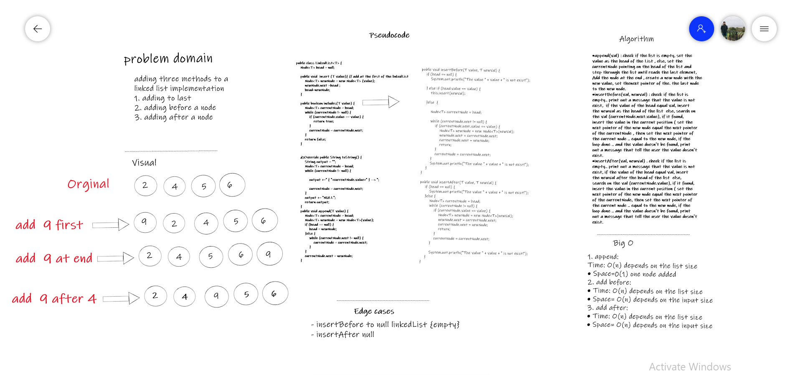

## Extension of Node list
###Challenge Summary
- **Write the following** methods for the Linked List class:

- **append arguments:** new value adds a new node with the given value to the end of the list insert before arguments: value, new value adds a new node with the given new value immediately before the first node that has the value specified insert after arguments: value, new value adds a new node with the given new value immediately after the first node that has the value specified

- Whiteboard Process:

- Big O : space O(n)

### Edge Cases:
- insertBefore to null linkedList {empty}
- insertAfter null

### Approach & Efficiency 
- with the (addBefore AND addAfter) methods, will start from the head and search on the specific value, if it found.. add the new value before or after it. If not, then print out a message or exception that tell the user the value is not exist.

the append method: start from head and step through the last element, then add the new value there. append :-time -->O(n) . addBefore :-time -->O(n). addAfter :-time -->O(n).

Solution
code files
code test files