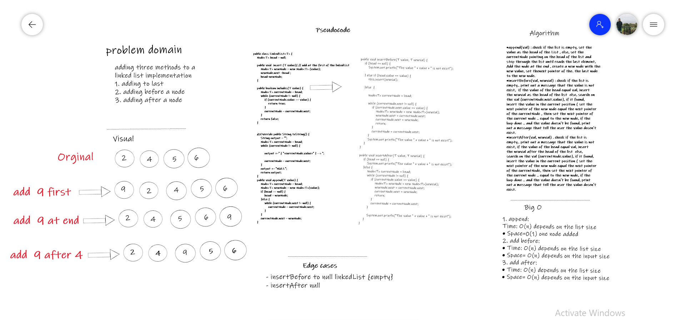
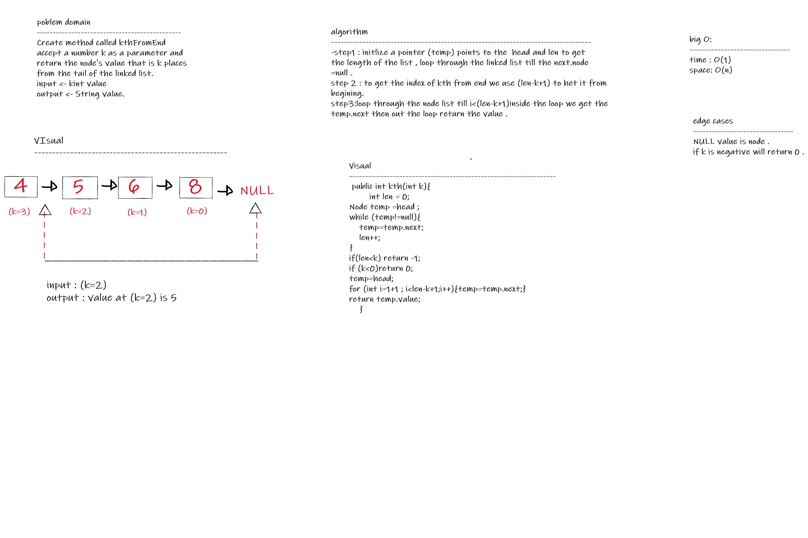

## Linked List :

**Linked List** is a part of the Collection framework present in java.util package. This class is an implementation of the LinkedList data structure which is a linear data structure where the elements are not stored in contiguous locations and every element is a separate object with a data part and address part.

### Challenge:
writing methods to insert elements in the list, search on specific elements and print the list as a string.

### Approach & Efficiency:
There are two main classes ( Node , LinkedList ), each Node has two fields (value, next node) and the LinkedList has one field which is the (head node) head will pointing always to the first node of the list, when you need to add value to the first of the list, it will take the head place and pointing to the old head.

* The time complexity is O(1) for insert method since we are only checking the first node and that gets pointed by the new node .
* The time complexity is O(N) for includes since at worst condition we might have to traverse through the list to see if the value exists.
* The time complexity is O(N) for toString since we traverse through the list to print out the String version.

### API:
 
* **insert(value);** will insert the passed value as a new head of the list and make its next pointer pointing on the old head.
* **includes(value);** will search through the list on the passed value, if it find the value .. the method will return true. else, will return false.
**toString();** will print out the whole linked list as a string to the user.

## Week2 , lab1 :
## Extension of Node list
###Challenge Summary
- **Write the following** methods for the Linked List class:

- **append arguments:** new value adds a new node with the given value to the end of the list insert before arguments: value, new value adds a new node with the given new value immediately before the first node that has the value specified insert after arguments: value, new value adds a new node with the given new value immediately after the first node that has the value specified

- Whiteboard Process:

- Big O : space O(n)

### Edge Cases:
- insertBefore to null linkedList {empty}
- insertAfter null

### Approach & Efficiency 
- with the (addBefore AND addAfter) methods, will start from the head and search on the specific value, if it found.. add the new value before or after it. If not, then print out a message or exception that tell the user the value is not exist.

the append method: start from head and step through the last element, then add the new value there. append :-time -->O(n) . addBefore :-time -->O(n). addAfter :-time -->O(n).

**Solution:**
- code files [here](lib)
- code test files [here](lib)

## kth challange :
### Challenge:

- **kth** from end argument: a number, k, as a parameter. Return the node’s value that is k places from the tail of the linked list. You have access to the Node class and all the properties on the Linked List class as well as the methods created in previous challenges.

Solution
Visual and Code

- Whiteboard Process:

- Big O :
time:o(1)
 space O(n)
