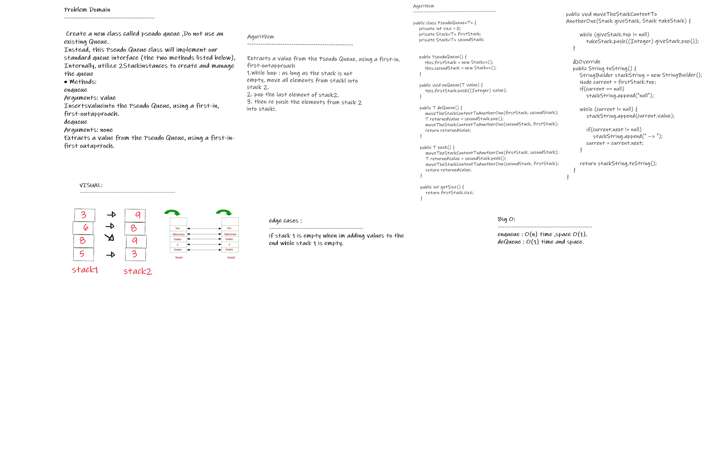
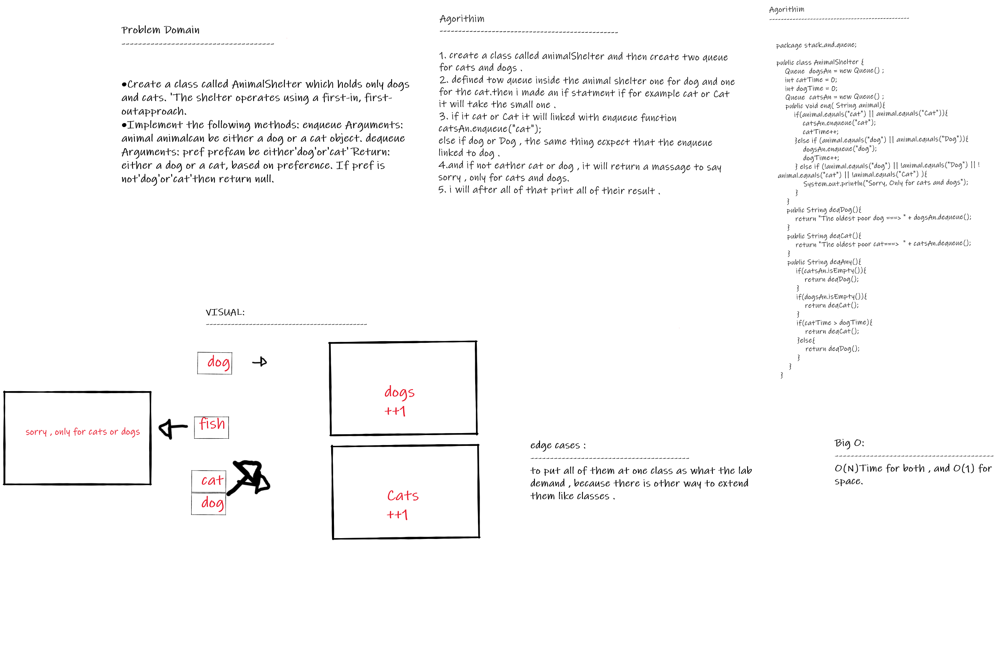

## Stacks and Queues
A Stack is a linear data structure or container of objects that are inserted and removed according to the last-in first-out (LIFO) principle or First-In Last-Out (FILO) principle, that mean the sequential access is only possible.

A Queue is a container of objects (a linear collection) that are inserted and removed according to the first-in first-out (FIFO) and (LILO) Last-In Last-Out principle.

### Challenge

* **create Stack class** has a top property. It creates an empty Stack when instantiated. The class should contain the following methods: push,pop,peek and isEmpty.

* **create Stack class** has a front property. It creates an empty Queue when instantiated. The class should contain the following methods: enqueue, dequeue, peek, isEmpty.

### Approach & Efficiency:

- **create a Node class** which take a value (whatever its type ) and the next properties , create a stack class and add the required and the appropriate methods to it.
- **Add the top** and size fields to the stack .. top will always pointing to the top values of the stack ,if the stack was empty.. the top will point on null.
- **Create a queue class** and add the required and the appropriate methods to it.
- **Add** the front, rear, and size field to this class , front will pointing on the oldest element entered the queue and the rear will pointin on the newest one.
- **When dequeue** from the stack will return the front element ,when enqueue to the stack will add as a rear element. 

- **For all** the method in Stack and Queue take same time and space complexity which is : Time -> O(1) Space -> O(1).

### API

**Stack method :**
- **push(x):** used to insert node at the top of the stack (pushed), we need to pass element that want to be bushed .
- **pop() :** used to delete node from the top of the stack and we don't pass an arg. it checked if the stack is empty or not before conducting a pop to ensure that an exception is not raised.
- **Peek():** function just returns the value of the top element available in the stack. it checked if the stack is empty or not before conducting a peek to ensure that an exception is not raised.
- **isEmpty() :** this function will return a true value if the stack is empty or otherwise it will return a false value.
**Queue method :**
- **enqueue(x)** - used to add node at the rear of the queue, need to pass arg that want to be added .
- **dequeue()** - used to delete node from the queue and don't need to pass an arg. it checked if the stack is empty or not before conducting a Dequeue to ensure that an exception is not raised.
- **Peek()** - function just returns the value of the Front element available in the queue. it checked if the queue is empty or not before conducting a peek to ensure that an exception is not raised.
- **isEmpty()** - returns true when queue is empty otherwise returns false.

## Code Challenge: Class 11
### Implement a Queue using two Stacks.

### Challenge :
- **Create a new class** called pseudo queue. Do not use an existing Queue. Instead, this PseudoQueue class will implement our standard queue interface (the two methods listed below), Internally, utilize 2 Stack instances to create and manage the queue Methods: enqueue Arguments: value Inserts value into the PseudoQueue, using a first-in, first-out approach. dequeue Arguments: none Extracts a value from the PseudoQueue, using a first-in, first-out approach.

### whiteBoard process:

### Big(O): 
- **enqueue :** O(n) time space O(1)
- **deQueue :** O(1) time and space

## Code Challenge: Class 12
## challenge

- **Create a class called AnimalShelter** which holds only dogs and cats. The shelter operates using a first-in, first-out approach. Implement the following methods: enqueue Arguments: animal animal can be either a dog or a cat object. dequeue Arguments: pref pref can be either "dog" or "cat" Return: either a dog or a cat, based on preference. If pref is not "dog" or "cat" then return null.

### whiteBoard process:

### Big O :
- Enqueue(String x) Time Complexity: O(1) or O(n) if preferred animal is at the end or gone.
-  Dequeue() Time Complexity: O(1) or O(n) if preferred animal is at the end or gone.