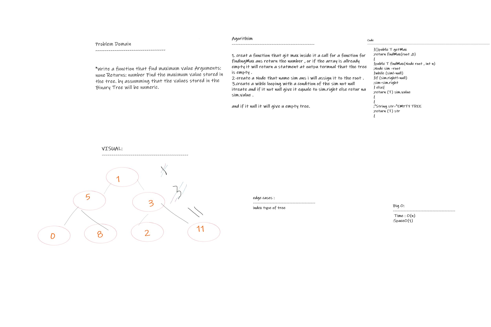
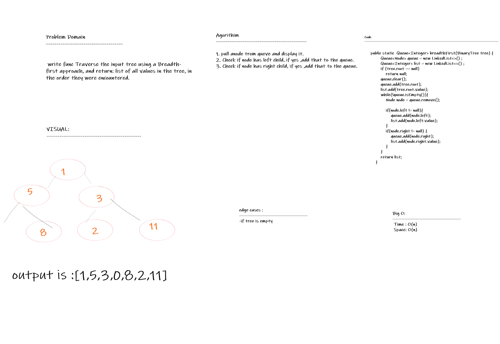
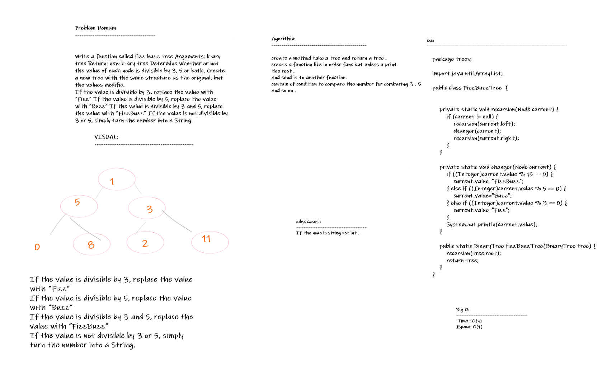

## Challenge

- **Create a Node class** that has properties for the value stored in the node, the left child node, and the right child node.
- **Create a BinaryTree** class .
- **Define a method** for each of the depth first traversals called preOrder, inOrder, and postOrder which returns an array of the values, ordered appropriately.
- **Create a BinarySearchTree** class .
- **Define a method** named add that accepts a value, and adds a new node with that value in the correct location in the binary search tree.
- **Define a method** named contains that accepts a value, and returns a boolean indicating whether or not the value is in the tree at least once.

## Approach & Efficiency

- **Binary Tree**
- **Time Complexity** of the Depth First traversals are all O(W), where W is the width. Traversals were done via recursion using private helper functions that takes in the arraylist to add values and eventually return, and a BinaryTreeNode. Binary Search Tree

insertValue -> Time Complexity is O(n), This was done via recursion. containsValue -> Time Complexity is O(log n).

## API:
**Add Arguments:** value Return: nothing Adds a new node with that value in the correct location in the binary search tree. Contains Argument: value Returns: boolean indicating whether or not the value is in the tree at least once.

## Code Challenge: Class 16
## Challenge
### Write the following method for the Binary Tree class:

- **find maximum value Arguments:** none Returns: number Find the maximum value stored in the tree. You can assume that the values stored in the Binary Tree will be numeric.

## Whiteboard Process : 

## Approach & Efficiency
- **Time O(n) because** we iterate inside while loop space O(1) because we didn’t assign more than one in the same time.

## Breadth-First Traversal :class17:
### Challenge
- **Write a function** called breadth first Arguments: tree Return: list of all values in the tree, in the order they were encountered NOTE: Traverse the input tree using a Breadth-first approach.

### Whiteboard Process :

### Approach & Efficiency
Time Complexity: O(n) where n is the number of nodes in the binary tree Space Complexity: O(n) where n is the number of nodes in the binary tree.

## Challenge
- **Write a function called** fizz buzz tree Arguments: k-ary tree Return: new k-ary tree Determine whether or not the value of each node is divisible by 3, 5 or both. Create a new tree with the same structure as the original, but the values modified as follows:

- **If the value is divisible** by 3, replace the value with “Fizz” If the value is divisible by 5, replace the value with “Buzz” If the value is divisible by 3 and 5, replace the value with “FizzBuzz” If the value is not divisible by 3 or 5, simply turn the number into a String.

### Whiteboard process :

## Big O:

- **O(n^2)**
